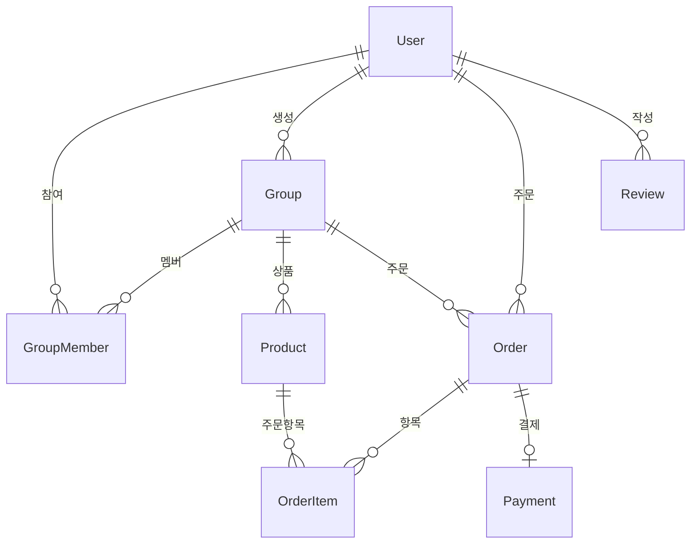

# 소분모임 커뮤니티 앱

코스트코, 트레이더스 등 대량 구매 상품을 소분할 수 있는 모임 커뮤니티 앱입니다.

## 🎯 프로젝트 개요

대형 마트에서 대량 구매 시 발생하는 비용 부담을 줄이고, 필요한 만큼만 구매할 수 있도록 도와주는 소분모임 플랫폼입니다.

### 주요 가치
- 💰 **비용 절약**: 대량 구매 할인 혜택을 소분으로 누리기
- 🌍 **환경 보호**: 필요한 만큼만 구매하여 음식물 쓰레기 줄이기
- 🤝 **커뮤니티**: 같은 지역 이웃들과 소통하며 함께 구매

## 📁 프로젝트 구조

```
sobun-community/
├── backend/          # NestJS 백엔드 API
│   ├── src/
│   │   ├── auth/     # 인증 모듈
│   │   ├── users/    # 사용자 모듈
│   │   ├── groups/   # 그룹 모듈
│   │   └── common/   # 공통 서비스
│   ├── prisma/       # 데이터베이스 스키마
│   └── package.json
├── frontend/         # React Native (Expo) 앱
│   ├── src/
│   │   ├── screens/  # 화면 컴포넌트
│   │   └── services/ # API 서비스
│   ├── app.json
│   └── package.json
├── shared/           # 공통 타입 패키지
│   └── src/
└── docs/            # 문서
```

## 🛠 기술 스택

### 백엔드
- **Framework**: NestJS
- **Database**: PostgreSQL
- **ORM**: Prisma
- **Authentication**: JWT
- **Language**: TypeScript

### 프론트엔드
- **Framework**: React Native (Expo)
- **Navigation**: React Navigation
- **Language**: TypeScript
- **State Management**: React State

### 공통
- **Package Manager**: npm
- **Monorepo**: npm workspaces
- **Type Sharing**: @sobun/shared

## 🚀 빠른 시작

### 1. 저장소 클론
```bash
git clone https://github.com/seokuuu/sobun-community.git
cd sobun-community
```

### 2. 의존성 설치
```bash
npm install
```

### 3. 환경 설정
```bash
# 백엔드 환경변수 설정
cp backend/.env.example backend/.env
# .env 파일 수정 필요
```

### 4. 데이터베이스 설정
```bash
cd backend
npx prisma migrate dev
npx prisma generate
```

### 5. 애플리케이션 실행
```bash
# 백엔드와 프론트엔드 동시 실행
npm run dev:both

# 또는 개별 실행
npm run dev:backend    # 백엔드만
npm run dev:frontend   # 프론트엔드만
```

## 📋 주요 기능

### ✅ 구현 완료
- 🔐 **사용자 인증**: 회원가입, 로그인, JWT 토큰 관리
- 👥 **그룹 관리**: 소분모임 생성, 참여, 탈퇴
- 📱 **모바일 앱**: React Native 기반 크로스플랫폼 앱
- 🔄 **실시간 동기화**: API 연동 및 상태 관리

### 🚧 개발 예정
- 🛍️ **상품 관리**: 상품 등록, 수정, 삭제
- 📦 **주문 시스템**: 장바구니, 주문 생성, 상태 관리
- 💳 **결제 시스템**: 토스페이먼츠 연동, 에스크로 결제
- 📍 **위치 기반**: 픽업 장소 설정, 근처 모임 찾기
- 💬 **채팅 시스템**: 실시간 채팅, 알림
- ⭐ **후기 시스템**: 평점, 댓글, 신뢰도 점수

## 📊 데이터베이스 스키마



주요 테이블:
- `users` - 사용자 정보 및 신뢰도 점수
- `groups` - 소분모임 정보 및 상태
- `group_members` - 그룹 멤버십 관리
- `products` - 상품 정보 및 가격
- `orders` - 주문 정보 및 상태
- `payments` - 결제 정보 및 상태
- `reviews` - 후기 및 평점

## 🔌 API 엔드포인트

### 인증 API
- `POST /api/auth/login` - 로그인
- `POST /api/users/register` - 회원가입
- `GET /api/users/profile` - 프로필 조회

### 그룹 API
- `GET /api/groups` - 그룹 목록 조회
- `POST /api/groups` - 그룹 생성
- `GET /api/groups/:id` - 그룹 상세 조회
- `POST /api/groups/:id/join` - 그룹 가입
- `DELETE /api/groups/:id/leave` - 그룹 탈퇴

## 📚 문서

- [📖 설치 가이드](./SETUP_GUIDE.md) - 개발 환경 설정 방법
- [🛠 개발 가이드](./DEVELOPMENT_GUIDE.md) - 개발 워크플로우 및 구조
- [🔌 API 레퍼런스](./API_REFERENCE.md) - 상세한 API 문서

## 🤝 기여하기

1. 이 저장소를 포크합니다
2. 기능 브랜치를 만듭니다 (`git checkout -b feature/amazing-feature`)
3. 변경사항을 커밋합니다 (`git commit -m 'Add amazing feature'`)
4. 브랜치에 푸시합니다 (`git push origin feature/amazing-feature`)
5. Pull Request를 생성합니다

## 📄 라이선스

이 프로젝트는 MIT 라이선스 하에 있습니다. 자세한 내용은 [LICENSE](LICENSE) 파일을 확인하세요.

## 📞 지원

- 📧 이메일: support@sobun-community.com
- 🐛 버그 리포트: [GitHub Issues](https://github.com/seokuuu/sobun-community/issues)
- 📖 문서: [개발 가이드](./DEVELOPMENT_GUIDE.md)

---

**Made with ❤️ by Sobun Community Team**